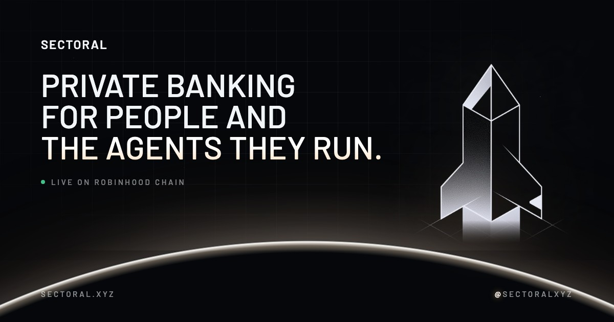

<p align="center">
  
</p>

<p align="center">
  <a href="https://sectoral.xyz">sectoral.xyz</a> &nbsp;·&nbsp;
  <a href="https://docs.sectoral.xyz">Docs</a> &nbsp;·&nbsp;
  <a href="https://x.com/sectoralxyz">@sectoralxyz</a>
</p>

# Sectoral

This is the Sectoral web app. Sectoral is banking on Robinhood Chain that stays private unless you choose otherwise, built both for people and for the AI agents spending money for them.

Two things live in this repo: the public marketing site and the signed-in product behind it. The complete product docs are published at [docs.sectoral.xyz](https://docs.sectoral.xyz/), which lets this file focus on the app alone: its structure and how to get it running on your machine.

## What it's built with

- React 19 on Next.js 16, using the App Router
- TypeScript from end to end
- Tailwind CSS v4 with the Sectoral design system (see below), plus a handful of shadcn primitives
- Barlow and Manrope, loaded through `next/font`
- Supabase, which provides auth, Postgres and row level security

## Running it locally

Requirements: Node 20 or later, and a Supabase project to point at.

```bash
npm install
npm run dev
```

Once started, open http://localhost:3000.

The app needs a `.env.local` file holding three values before it can do real work:

| Variable | What it's for |
| --- | --- |
| `NEXT_PUBLIC_SUPABASE_URL` | The URL of your Supabase project |
| `NEXT_PUBLIC_SUPABASE_ANON_KEY` | The Supabase anon key (fine to ship to the browser) |
| `NEXT_PUBLIC_DEPOSIT_ADDRESS` | The address displayed on the wallet top up screen |

Migrations are kept in `supabase/migrations` at the repo root, not under `src`. Run them before you sign in. If you skip them, login still succeeds, but every query returns nothing.

## Available scripts

- `npm run dev` launches the dev server
- `npm run build` creates an optimized production build
- `npm run start` serves the result of that build
- `npm run lint` checks the code with ESLint

## Project structure

```
src/
  app/
    page.tsx          marketing home page
    roadmap/          public roadmap
    status/           service status page
    login/            log in
    signup/           create an account
    auth/callback/    handles the Supabase email confirmation link
    auth/confirmed/   screen shown after the email is confirmed
    app/              the signed-in product
  components/         marketing sections and shared UI pieces
    sx.tsx            design system building blocks (Brand, SectionHeader, Telemetry, Arrow)
    app/              pieces of the signed-in app (shell, accounts home), shared with the home page's product preview
    mockups/          product mockups shown on the home page, built on MockKit.tsx
  lib/supabase/       browser and server clients, along with the hand maintained DB types
  types/              shared TypeScript types
  middleware.ts       refreshes the session and guards routes
```

All of `src/app/app` requires a signed-in user. In the sidebar it is split into three groups: banking (accounts, send payment, cards, wallet), agents (agent accounts, activity, analytics) and developer tools (API keys, alerts, status). Settings sits by itself at the bottom.

## Design system

Sectoral looks like mission control for money: near-black space, hairline structure, uppercase engineered type, telemetry readouts and a single cool accent. The one-line brief every screen is held to is "SpaceX mission control meets a Swiss private bank, with Linear's precision."

Everything lives in two places:

- `src/app/globals.css` holds the tokens (`--sx-*`) and the `sx-*` utility classes, grouped under the SECTORAL DESIGN SYSTEM banner.
- `src/components/sx.tsx` holds the few React pieces that fix structure: `Brand` (rocket mark and wordmark), `SectionHeader`, `Telemetry` and `Arrow`. `Reveal.tsx` fades sections in on scroll.

### Type

| Role | Face | Treatment |
| --- | --- | --- |
| Display: headlines, numbers, labels, buttons | Barlow | Uppercase, letter-spaced, weight 500 to 600 |
| Body and interface text | Manrope | Sentence case, 13 to 18px, line height around 1.6 |
| Code, hashes, addresses, API keys | System mono | Only where characters must line up |

Both faces load through `next/font` in `src/app/layout.tsx`. Overlines (`sx-overline`) are the small, spaced, uppercase labels that sit above almost every heading. All caps is reserved for display type and labels of a few words; body copy is never uppercase.

### Color

| Token | Value | Use |
| --- | --- | --- |
| `--sx-bg` | `#05070A` | Page background |
| `--sx-panel` / `--sx-raised` | `#0D1117` / `#0A0D12` | Solid panels, sidebars |
| `--sx-surface` | 3.5% white | Cards and translucent surfaces |
| `--sx-line` / `--sx-line-strong` | 7% / 12% white | Hairline borders and rules |
| `--sx-text` to `--sx-text-5` | `#F2F5F8` at 100, 68, 46, 28, 14% | Text hierarchy |
| `--sx-accent` | `#FFFAF4` white heat | Primary actions, active states, the one highlight per view |

The accent is the white at the core of a very hot flame. It comes in five strengths (`--sx-accent`, `-muted`, `-bg`, `-surface`, `-line`), and its glow (`--sx-accent-glow`, and `--sx-heat` for custom halos) carries a faint warm edge, the way white-hot metal does. Only the primary button and active states wear the glow. Green, amber and red (`--sx-ok`, `--sx-warn`, `--sx-danger`) describe state and are never decoration. There is no second accent, no purple and no light theme.

### Shape and atmosphere

- Radius grows with importance: 4px tags, 6px small buttons, 10px buttons and inputs, 14px rows, 20px cards, 28px hero frames and sheets.
- Depth comes from hairlines and translucency rather than drop shadows.
- Signature elements: the planet horizon (`sx-horizon`), a faint starfield (`sx-stars`), a fading blueprint grid (`sx-grid`), film grain (`sx-noise`), instrument corner brackets (`sx-hud`) and telemetry readouts (`sx-telemetry`).
- Motion is slow and quiet (`sx-rise`, `sx-reveal`), and switches off under `prefers-reduced-motion`.

### Product pages

Every page under `src/app/app` follows the same frame: an `sx-app-page` wrapper, a header (`sx-page-head`) with an overline, title, one-line description and the primary action on the right, a row of KPI tiles (`sx-kpis`), then lists in `sx-card-solid` panels built from `sx-row` or `sx-table`. Forms use `sx-field`, `sx-label` and `sx-input`; toggles are `sx-switch`; filters are `sx-segmented`; empty, loading and error states use `sx-empty`, `sx-skeleton` and `sx-alert-danger`. Every view is designed to work at 390px wide.

### Brand assets

| File | What it is |
| --- | --- |
| `public/images/new_logo.png` | Master rocket artwork, 2048px on black |
| `public/images/logo.png` | Rocket mark, transparent. Used only as the brand mark (beside the wordmark, on cards, as the icon), never as decoration |
| `public/images/logo-bg.png` | Rocket on black, for email and anywhere transparency is unsafe |
| `src/app/icon.png`, `src/app/apple-icon.png` | Browser and home screen icons |
| `public/images/og.jpg` | Social preview card |
| `public/images/card.png` | Virtual debit card artwork |
| `public/images/hero.png` | Backdrop photograph behind the home page hero |

When adding UI, reach for the tokens and `sx-*` classes before writing a color or a size by hand.

## Things to keep in mind

**The client never moves money.** Every transfer, top up and policy change runs through a Postgres function defined in the migrations; the app invokes the function and reads what it returns. Nothing in `src` writes to a balance directly, and that is on purpose. Because the database enforces the very rules the UI displays, a broken form cannot turn into a broken balance.

**The database types are maintained by hand.** `src/lib/supabase/database.types.ts` is written manually to match the schema, not generated with the Supabase CLI, so any migration change needs a matching edit there. A trap we have fallen into repeatedly: each `Row`, `Insert`, `Update` and `Args` shape in that file must be a `type`, not an `interface`. The Supabase client checks them against `Record<string, unknown>`, a check TypeScript only passes for object literal type aliases. Declare one as an `interface` and every `.from()` call silently becomes `never`, and no error tells you why.

**An agent account is just an account with a policy on it.** Each agent has an account, a handle and a balance of its own, along with a spend policy limiting how much it can send per transaction and per day. Revoking an agent keeps its history; the only effect is that the account can no longer send.

## The three privacy tiers

There are three tiers, every account has exactly one, and it determines what a transfer exposes on chain:

- **Public**: both amounts and counterparties can be seen
- **Confidential**: amounts are encrypted while counterparties stay visible
- **Shielded**: neither amounts nor counterparties are visible

New accounts default to Confidential. Since the tier is a property of the account and not of any single transfer, an agent has no way to lower its own privacy partway through a session.
